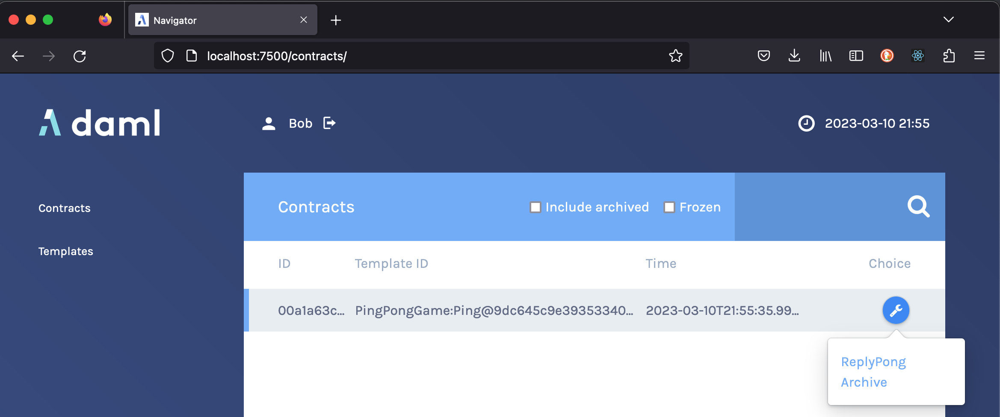

# Daml Ledger API Node.js Bindings Tutorial

## Table of contents

1.  [Introduction](#introduction)
2.  [Prerequisites](#prerequisites)
3.  [Create the project](#create-the-project)
4.  [Compile the Daml Code](#compile-the-daml-code)
5.  [Run the sandbox](#run-the-sandbox)
6.  [Run the skeleton app](#run-the-skeleton-app)
7.  [Understand the skelelon](#understand-the-skeleton)
8.  [Retrieve the package identifiers](#retrieve-the-package-identifiers)
9.  [Understand the PingPongGame module](#understand-the-pingponggame-module)
10. [Allocate parties](#allocate-parties)
11. [Start the server](#start-the-server)
12. [Read the server](#read-the-server)

## Introduction

This tutorial guides you through a series of steps to write a simple
[Daml](https://daml.com/) application interacting with a [Node](https://nodejs.org/en/) server
directly via gRPC bindings.

The task is to build an application able to send and receive Ping & Pong messages.
The focus is not on the complexity of the model, but rather on how to use the bindings to interact with the ledger.

[Back to the table of contents](#table-of-contents)

## Prerequisites

Make sure you have the Daml SDK installed and that the version matches the one in this project's `daml.yaml`.

[Back to the table of contents](#table-of-contents)

## Create the project

There is a skeleton application called `ex-tutorial-nodejs` that you can get from the [GitHub](https://github.com/digital-asset/ex-tutorial-nodejs).

To set it up, clone the repo, making sure to checkout the tag corresponding to the Node.js bindings version you are using:

    $ git clone git@github.com:digital-asset/ex-tutorial-nodejs.git
    $ cd ex-tutorial-nodejs

The repo includes `daml/PingPongGame.daml`, which is the source for a Daml module with two templates: `Ping` and `Pong`. The app uses these.

[Back to the table of contents](#table-of-contents)

## Compile the Daml code

Before getting started, move to the project root directory and build the Daml code with

    $ daml build

[Back to the table of contents](#table-of-contents)

## Run the sandbox

Use the sandbox to run and test your application.
Open a new shell (the running sandbox will keep it busy), and
start the sandbox by running

    $ daml start

[Back to the table of contents](#table-of-contents)

## Run the skeleton app

You are now set to write your own application. The template includes a skeleton app that connects to a running ledger and quits.

1. Install the dependencies for your package (including the bindings):

       $ npm install

2. Start the application:

       $ npm start

3. Verify the output is correct

       hello from sandbox

[Back to the table of contents](#table-of-contents)

## Understand the skeleton

The code for the script you just ran is `index.ts`.
Let's go through the skeleton part by part to understand what's going on:

    import * as ledger from "@digitalasset/daml-ledger";

The first line loads the bindings and allows you to refer to them through the `ledger` object.

    let [, , hostArg, portArg] = process.argv;

    let host = hostArg || 'localhost';
    let port = parseInt(portArg) || 6865;

These lines read the command-line arguments and provide some sensible defaults.
Now to the interesting part:

    ledger.DamlLedgerClient.connect({ host, port}, (error, client) => {
        if (error) throw error;
        if (client)
          console.log('hello from', client.ledgerId);
    });

Here the application connects to the ledger with the `DamlLedgerClient.connect` method.
It accepts two arguments:

- an object with the connection options
- a callback to be invoked when the connection either fails or succeeds

The connection options require you to pass the `host` and `port` of the ledger instance you are connecting to.
The callback follows the common pattern in Node.js of being invoked with two arguments: the first is an error in case of failure while the latter is the response in case of success.
In this case in particular, the response in case of success is a `client` object that can be used to communicate with the ledger.
The skeleton application just prints the greeting message with the ledger identifier and quits.

[Back to the table of contents](#table-of-contents)

## Retrieve the package identifiers

Now that the sandbox is running, the `PingPongGame.daml` file has been compiled and the module loaded onto the ledger.
In order for you to refer to the templates therein you need its package identifier.
This project includes a script that connects to a running ledger instance and downloads the package identifiers for the templates.
Run it now:

    $ npm run fetch-template-ids

If the program ran successfully, the project root now contains the `template-ids.json` file.

It's time to write some code to verify that you're good to go. Open the `index.ts` file and edit it.
Right after the first `import` statement, add a new one to load the `template-ids.json` file that has just been created.

    import * as ledger from "@digitalasset/daml-ledger";
    import * as templateIds from './template-ids.json';

Right beneath that line, initialize two constants to hold the `Ping` and `Pong` template identifiers:

    const PING = templateIds['PingPongGame:Ping'];
    const PONG = templateIds['PingPongGame:Pong'];

Finally print the template identifiers:

    ledger.DamlLedgerClient.connect({ host: host, port: port }, (error, client) => {
        if (error) throw error;
        if (client) {
          console.log('hello from', client.ledgerId);
          console.log('Ping', PING);
          console.log('Pong', PONG);
        }
    });

Run the application again (`npm start`) to see an output like the following:

    hello from sandbox
    Ping {
      packageId: '9dc645c9e39353340bcdec3a40abba40007124d3d45ed16f6751fdcb7171da57',
      moduleName: 'PingPongGame',
      entityName: 'Ping'
    }
    Pong {
      packageId: '9dc645c9e39353340bcdec3a40abba40007124d3d45ed16f6751fdcb7171da57',
      moduleName: 'PingPongGame',
      entityName: 'Pong'
    }

[Back to the table of contents](#table-of-contents)

## Understand the `PingPongGame` module

Before moving on to the implementation of the application, have a look at `daml/PingPongGame.daml` to understand the module the app uses.

`Ping` and `Pong` are almost identical. Looking at them in detail:

- both have a `sender` signatory and a `receiver` observer
- the receiver of a `Ping` can exercise the `ReplyPong` choice, creating a `Pong` contract with swapped `sender` and `receiver`
- symmetrically, the receiver of a `Pong` contract can exercise the `ReplyPing` choice, creating a `Ping` contract with swapped parties

Note that the contracts carry a counter: when the counter reaches 3, no new contract is created and the exchange stops.

[Back to the table of contents](#table-of-contents)

## Allocate parties

All actions on a Daml ledger need to be authored by a `Party`,
so we need to allocate some for use in our ledger.
When you run

    $ daml ledger allocate-parties Alice

    Checking party allocation at localhost:6865
    Allocating party for 'Alice' at localhost:6865
    Allocated 'Alice::12201465a2225e2c8aef46b2d5799073059862cea6fdf44fa1f5a92a41c17f27c3aa' for 'Alice' at localhost:6865

The string `Alice::12201465a2225e2c8aef46b2d5799073059862cea6fdf44fa1f5a92a41c17f27c3aa` provides
the full `Party` identifier for **Alice**, save it for later!
Allocate another party for **Bob** so that they can send games to each other.

[Back to the table of contents](#table-of-contents)

## Start the server

Now one can start a server that will play the PingPong game for one of the parties by passing in the two parties we created:

    $ npm run server Alice::12201465a2225e2c8aef46b2d5799073059862cea6fdf44fa1f5a92a41c17f27c3aa Bob::12201465a2225e2c8aef46b2d5799073059862cea6fdf44fa1f5a92a41c17f27c3aa

If we inspect the code of `server.ts`

    let [, , sender, receiver, initialNumberOfPingsArg, hostArg, portArg, ] = process.argv;
    let initialNumberOfPings = parseInt(initialNumberOfPingsArg) || 1;
    let host = hostArg || 'localhost';
    let port = parseInt(portArg) || 6865;
    if (!sender || !receiver) {
        console.log('Missing sender and/or receiver arguments, exiting.');
        process.exit(-1);
    }

The two arguments determine who is the `sender` and `receiver` of the actions. The server will "play" as the `sender`.

    DamlLedgerClient.connect({ host, port}, (error, client) => {
        if (error) throw error;
        if (client) {

            // Setup filters for just the PING and PONG contracts seen by the sender.
            const filtersByParty : Record<string, Filters> = {} ;
            filtersByParty[sender] = { inclusive: { templateIds: [PING, PONG] } };
            const transactionFilter = { filtersByParty: filtersByParty };

            // Register a callback to Pong a Ping and Ping a Pong.
            const eventCallback = (workflowId:string, events:CreatedEvent[]) =>
                    react(client, workflowId, events)

            // In the beginning look at all currently active contracts on the ledger
            // and react to them with the above call back.
            processActiveContracts(client, transactionFilter, eventCallback,
                // And then afterwards
                (offset : string) => {
                    // Listen to all new transactions.
                    listenForTransactions(client, offset, transactionFilter,
                        // React to them in the same way.
                        eventCallback);
                    // But also create a set of new pings for the receiver.
                    for(let p = 0; p < initialNumberOfPings; p++)
                        createPing(client);
            });
        };
    });

At this point one can [login](http://localhost:7500/sign-in/) into [Daml Navigator](https://docs.daml.com/tools/navigator/index.html) (started in the background on `daml start`) and play as Bob:

Or start a server for Bob, maybe with more Pings!

    $ npm run server Bob::12201465a2225e2c8aef46b2d5799073059862cea6fdf44fa1f5a92a41c17f27c3aa Alice::12201465a2225e2c8aef46b2d5799073059862cea6fdf44fa1f5a92a41c17f27c3aa 10

Note that the server will stay alive until you kill it with CTRL-C.

[Back to the table of contents](#table-of-contents)

## Read the server

`server.ts` is documemted to describe how it uses various parts of the [Ledger API](https://docs.daml.com/app-dev/ledger-api.html)

[Back to the table of contents](#table-of-contents)
